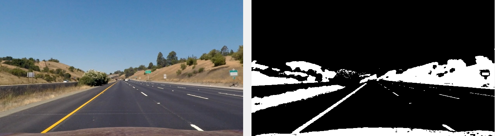
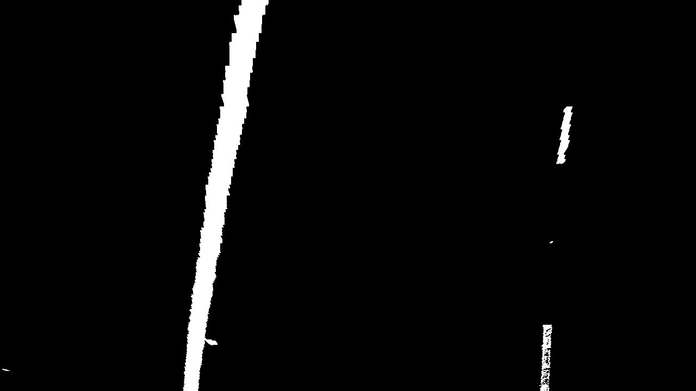
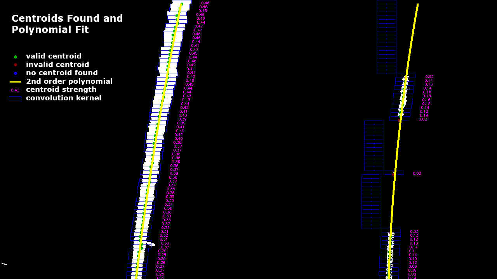

# Advanced Lane Finding Project

---

## Project Description

The goals / steps of this project are the following:

* Compute the camera calibration matrix and distortion coefficients given a set of chessboard images.
* Apply a distortion correction to raw images.
* Use color transforms, gradients, etc., to create a thresholded binary image.
* Apply a perspective transform to rectify binary image ("birds-eye view").
* Detect lane pixels and fit to find the lane boundary.
* Determine the curvature of the lane and vehicle position with respect to center.
* Warp the detected lane boundaries back onto the original image.
* Output visual display of the lane boundaries and numerical estimation of lane curvature and vehicle position.

---

## Github Repo

The github repo of my project is [here](https://github.com/lajos/CarND-Advanced-Lane-Lines).

---

## Camera Calibration

Camera lenses introduce distortions into images. Due to distortion straight lines appear curved.

[OpenCV](http://opencv-python-tutroals.readthedocs.io/en/latest/py_tutorials/py_calib3d/py_calibration/py_calibration.html) provides tools to calculate the camera matrix and distortion coefficients and to undistort the images.

The first step is to capture images of a checkerboard in several different views. Then using the `cv2.findChessboardCorners()` function we find a grid of corners in the checkerboard images (in this case 9x6 points.). Here's one of the images with the corners visualized using the `cv2.drawChessboardCorners()` function:

The corner positions can be further refined with `cv2.cornerSubPix()`.

Once we have the corner positions for our set of images, we pass the index of each point ( (1,0,0), (2,0,0), ... (9,6,0) ) and their detected positions to `cv2.calibrateCamera()`, which calculates the camera matrix and distortion coefficients. At this point we can use `cv2.undistort()` with the camera matrix and distortion coefficients to correct the camera distortion of our images:

The camera calibration and undistortion functions are located in the `camcalib.py` module.

---

## Thresholded Binary Image

In this step we'll isolate the lane pixels by selecting value ranges in several color model channels.

To make this process easier I made a GUI using [Tkinter](https://wiki.python.org/moin/TkInter).

The GUI allows easy mixing of channels, adjustment of threshold values, and checking the results on a set of test images.

I've used three color models: [RGB](https://en.wikipedia.org/wiki/RGB_color_space) (red, green blue channels), [HLS](https://en.wikipedia.org/wiki/HSL_and_HSV)  (hue, lightness and saturation) and [CIELUV](https://en.wikipedia.org/wiki/CIELUV) (lightness and u*, v* chromatic channels).

*RGB, HLS color space and CIELUV chromatic space (images from wikipedia.org)*

Using the GUI we can select a range for each channel. In this image pixels in the range of 173..255 in the red channel of RGB are colored white, other pixels are black:

*RGB red channel, range 173..255*

The CIELUV u' channel of the same image in the 105..255 range:

*CIELUV u' channel, range 105..255*

The logic OR combination of these two thresholded images:

*Combination of R 173..255 and u' 105..255*

Ideally we would find a mixture of thresholded channels where the yellow and white lane markers are isolated with the rest of the image black. This is unfortunately not possible, so we have to find a best compromise where the lanes are most separated from the environment.

In the lectures we also looked at using the [Sobel filter](https://en.wikipedia.org/wiki/Sobel_operator) that identifies changes in the image gradient. While it's implemented in the code and the GUI, I found that it created too much noise so didn't use it for lane detection. This is an example of a Sobel filter on the HLS lightness channel:

*Sobel filter on HLS lightness channel, kernel 1, range 51..169*

The GUI, channel thresholding functions and Sobel filter are located in the `thresh.py` module.

---

## Image Warping

Our images were taken from a camera mounted to the car showing a perspective similar to what the driver sees. Detecting the lanes would be much easier from a top down view, so in this step we'll apply a transformation to the images to remove the perspective.

To visualize this transformation and make adjustments easier I made another GUI:

This GUI also loads a set of test images, this time after the thresholding operation. The transformation can be adjusted with sliders and I drew a grid on the output image to aid getting things straight.

The transformation takes a rectangular region, in this case a trapezoid matching the perspective of road surface, and warps it into another rectangle with the sides parallel to remove the perspective. In the image below the green dots show the four corners of the source trapezoid (red outline). The blue dots show the new positions for the corners.

We first calculate a transformation matrix from the source points ((x1,y1),(x2,y2),(x3,y3),(x4,y4)) the the destination points ((x'1,y'1),(x'2,y'2),(x'3,y'3),(x'4,y'4)) using `cv2.getPerspectiveTransform()` and then `cv2.warpPerspective()` transforms the image based on the matrix. The output, with a grid drawn over it:

I found it tedious to pick the points by hand, so instead the controls are:
* **top width**: source trapezoid top side width
* **top y position**: distance of the top side from the top of the image
* **bottom width**: source trapezoid bottom width
* **bottom y position**: distance of the bottom side from the top of the image
* **dst width**: width of the destination rectangle

The source and destination points are calculated in code from these inputs.

The code for the perspective adjustment GUI and image warping functions are located in the `persptrans.py` module.

---

## Lane Finding

To find the lane line pixels I used the convolution method.

Convolution is a process of calculating the weighted sum of neighboring pixels in a window and assigning the calculated value to the current pixel. The neighboring pixel weights are defined by a matrix that is the same size as the window.

For the convolution we are using the output of the last step, the binary thresholded images warped to remove the perspective.

*Warped binary threshold image*

The first step is to divide the image into horizontal stripes. We'll find the left and right lane positions in these stripes. I chose a height of 10 for the stripes, so for our 720 pixel tall image we'll have a possible 72 points for each lane.

*Image stripes for convolution (both light and dark stripes are used)*

For each stripe, we slide the convolution window (red rectangle) across the width of the image to calculate the convolution signal. For the convolution kernel we use 1 for all weights, because we want to detect all pixels where our binary thresholded image is 1. We start with the bottom stripe, because we have a good intuition that the lane lines start at the halfway point in the left and right sides of the image. The width of the convolution window is 50 pixels.

*Convolution window for first stripe*

We are looking for the center of the left and right lanes represented by the red lines. The convolution signals, plotted in white, have plateaus in that area, however if we looked for the local maximum we would either find the edge of the lines, or would have to calculate how wide the plateaus are and find their centers.

*Convolution signal*

I've applied a 1D [Gaussian filter](https://en.wikipedia.org/wiki/Gaussian_filter) to the convolution signal that creates distinct peaks. At this point we can search for the maximum to find the center of the lanes. To start, we use a range of 200 pixels at the halfway point in the left and right sides of the image.

*Gaussian filtered convolution signal and search ranges for the left and right lanes*

We also assign a strength value to the lane center points (centroids). The strength value is 1 if the convolution window was fully covered by white pixels and 0 if no white pixels were found. We'll use this strength value to filter out centroids where noise was detected (very low value), or if the signal was too strong, which would indicate low confidence because the centroid might have picked up a for example a large reflection on the road.

We repeat this process for the rest of the stripes. If we have found a centroid on the stripe below, or we found a centroid in that stripe in the previous frames, we use that information as a hint to determine what range to search the current centroid.

When we have all the centroids for the image, we fit a second order polynomial on the centroids using the [numpy.polyfit](https://docs.scipy.org/doc/numpy/reference/generated/numpy.polyfit.html) function. This will be our mathematical representation of the left and right lanes.

In this image below the following are illustrated:

* **green dots** - valid centroids
* **red dots** - invalid centroids (strength too low or too high)
* **blue dots** - no centroid found for a lane in the stripe
* **blue rectangles** - the convolution kernel size and location for a centroid
* **magenta numbers** - centroid strength (how much of the kernel was covered by white pixels)

*Result of centroid search and polynomial fit*

In a perfect world where thresholding would've resulted in binary images with distinct lane lines, the job would've been done at this point. However thresholding has it's limits. Below is an image from the challenge video where part of the frame was overexposed as the car was driving under a bridge.

*Challenge video lane search data with half of the image overexposed*

I've used several techniques to enhance the robustness of lane finding:

* **centroid strength** - discard weak (noise) and strong (for example possible highlights) centroids
* **centroid accumulator** - accumulate centroid locations and use the accumulated positions to find centroids in the current frame
* **minimum number of centroid points** - if there are too few centroids found for a lane, the last poly (from previous frame) is used
* **limit maximum *a* difference** - use last poly if the **a** parameter of our second order polynomial changes too much from the previous frame
* **limit *a* sign change** - to prevent curves from unexpectedly flipping, if the sign of the **a** parameter changes and doesn't seem consistent with the previous frame and the other lane's poly, use last poly
* **find better poly fit** - find a better poly fit by ignoring top of frame centroids, small clumps of centroids and randomly changing the weight of the data points (for error, I simply used the distance of the old `np.polyval` at the top and bottom of the image)

I was planning other enhancements, but ran out of time. Some ideas for the future:

* **check distance between left and right centroids** - discard centroids if they are too close or too far apart
* **RANSAC** - use [random sample consensus](https://en.wikipedia.org/wiki/Random_sample_consensus) for better outlier detection
* **equalize images** - use [adaptive histogram equalization](https://en.wikipedia.org/wiki/Adaptive_histogram_equalization) to diminish the effect of shadows and highlights
* **automatic parameter adjustment** - try to adjust thresholding and detection parameters automatically
* **use several sources** - instead of combining all thresholded images, use them individually for centroid detection

---

## Project Detected Lanes, Display Curvature and Center Offset

I used OpenCV's drawing functions to draw the lane polynomials and the detected lane area on an image in the warped space.

*Graphic of lanes and lane area in warped space*

Using the inverse of the warp matrix I transformed this image back to the camera view.

*Graphic of lanes and lane area in camera space*

As a last step I composited lane graphic over the image and added text displaying the curvature and offset from center.

*Detected lane lines, lane area, curvature and center offset on the camera image*

---

## Offset from Center Calculation

To calculate the car's offset from the center of the lane, I evaluated the lane polynomials at the bottom of the image and calculated how far their midpoint was offset from the horizontal center of the image. (Assuming that the camera was mounted in the center of the car and was facing forward.)

*Center offset calculation*

The calculation was based on the lanes being 3.7m apart.

---

## Lane Curvature Calculation

The curvature calculation for a second order polynomial is:

*Second order polynomial curvature formula*

To calculate the curvature correctly, we first have to convert our pixel positions to meters. I've estimated that one pixel in the **y** direction was about 0.042m and in the **x** direction 0.005m.

I converted the centroid positions to pixels, evaluated the polynomial at the bottom of the frame and calculated the curvature using the above formula.

---

## Videos

### Project Video

The hardest part of this video were the areas where the car drove over a bridge and the road color changed and the shadow from the trees on the left side.

### Challenge Video

The challenge here was that the car drove under the bridge where the lighting conditions changed and the camera overexposed as the car came out from under the bridge. In these situations the lanes completely disappeared from the thresholded images, so I had to make sure that the lane finding function could hold the last known good polys.

### Rain Video

I wanted to test my lane finding pipeline in the real world. Unfortunately that day it was pouring cats and dogs in Massachusetts. I taped my phone to the center mirror of my car and recorded a video driving on the freeway by my house. The camera was not facing straight, the windshield was wet and the wipers were going. But I guess a snowstorm would've been worse.

### Project Video Diagnostics

Centroids and polys for the project video.

### Challenge Video Diagnostics

Centroids and polys for the challenge video.

### Rain Video Diagnostics

Centroids and polys for the rain video.

---

## Submission Files

### Python Code
* **src/main.py** - main lane finding script, executes GUIs for parameter adjustments and processes videos
* **src/camcalib.py** - camera calibration module
* **src/thresh.py** - thresholding module, threshold adjustment GUI and thresholding functions
* **src/persptrans.py** - perspective transformation module, adjustment GUI and warping functions
* **src/find_lanes.py** - lane finding module
* **src/constants.py** - project constants
* **src/utility.py** - utility functions
* **src/globals.p** - pickle file containing adjustment parameters

### Test Images
* **output_images/calibration** - undistorted camera calibration images
* **output_images/undistort** - undistorted camera images
* **output_images/thresh** - thresholded images
* **output_images/persptrans** - warped thresholded images

### Video Files
* **videos/project_video.mp4** - processed project video
* **videos/challenge_video.mp4** - processed challenge video
* **videos/rain_video.mp4** - processed rain video
* **videos/project_diag.mp4** - project video centroids and polys
* **videos/challenge_diag.mp4** - challenge video centroids and polys
* **videos/rain_diag.mp4** - rain video centroids and polys

The camera undistorted calibration images for my phone's camera are available in my [github repo](https://github.com/lajos/CarND-Advanced-Lane-Lines/tree/master/output_images/calibration) for the project.

---

